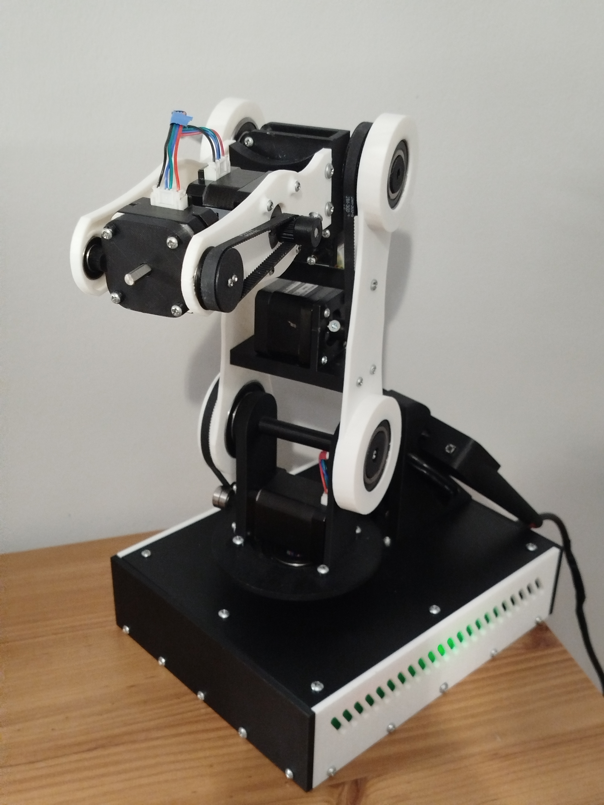

# Educational 6-DOF Manipulator – Engineering Thesis

## Description

This project presents the design and implementation of an educational anthropomorphic robotic manipulator with six degrees of freedom.

The project was developed as an engineering thesis and combines multiple areas of mechatronics, including mechanical design, kinematic analysis, embedded systems, electronics and software development.

The main goal was to design a complete robotic system capable of controlled movement, position control and practical validation of kinematic assumptions.

## Features

* 6 degrees of freedom
* Custom mechanical structure
* Kinematic modelling
* Forward kinematics
* Inverse kinematics
* Embedded control system
* Web-based control interface
* Repeatability testing
* Custom control electronics

## Hardware

* ESP32
* Stepper motor drivers
* Custom control PCB
* Stepper motors
* Bearings and belt transmission
* 3D printed mechanical parts

## Software

* C/C++
* Forward kinematics
* Inverse kinematics
* WebServer
* Remote control interface
* Position calculations

## Project scope

The project included:

* development of design assumptions,
* kinematic modelling,
* mechanical CAD design,
* design of control electronics,
* software development,
* assembly and integration,
* experimental validation.

## Challenges

Main development challenges:

* implementation of inverse kinematics,
* movement synchronization between joints,
* mechanical accuracy,
* repeatability of positioning,
* integration of hardware and software,
* optimization of movement trajectories.

## Validation

To evaluate system performance, repeatability and positioning tests were performed using predefined trajectories and repeated movement cycles.

The results allowed verification of the adopted kinematic assumptions and identification of mechanical limitations of the prototype.

## Current status

Working prototype built and tested as a complete engineering thesis project.
